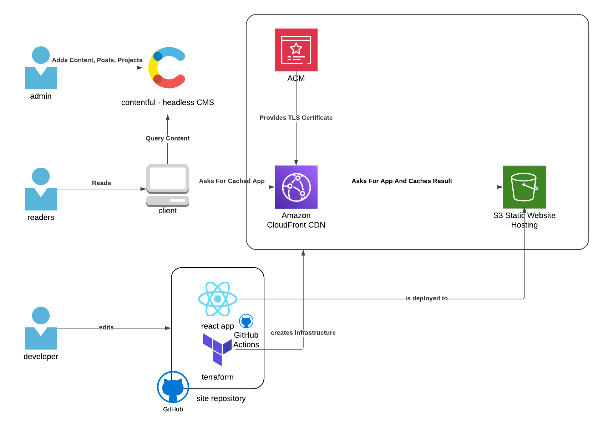
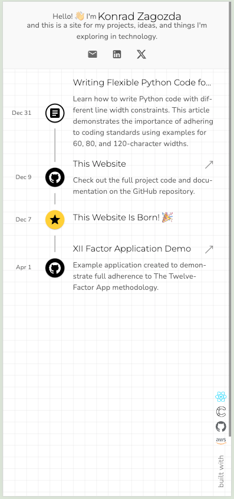
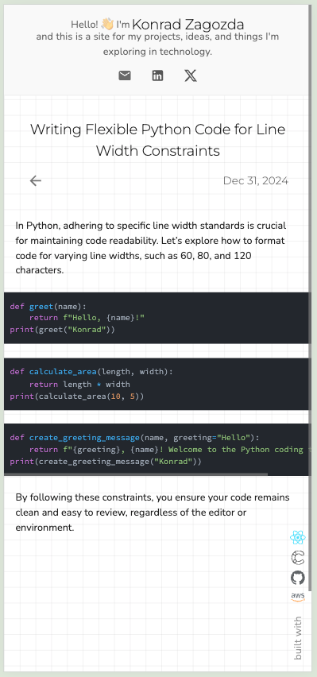
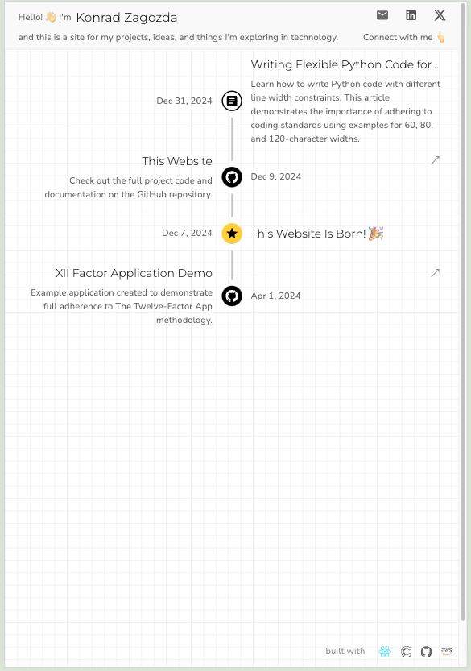
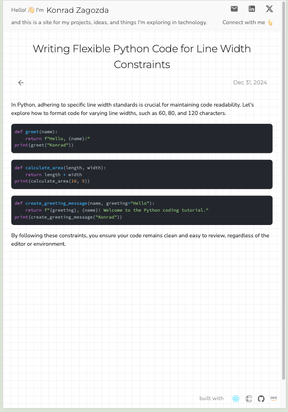
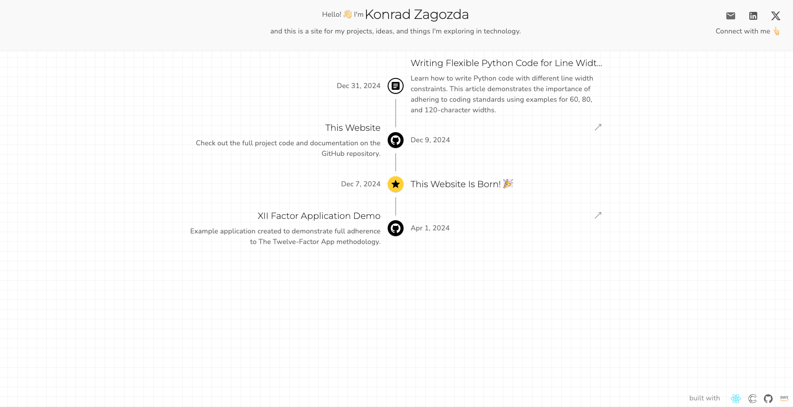
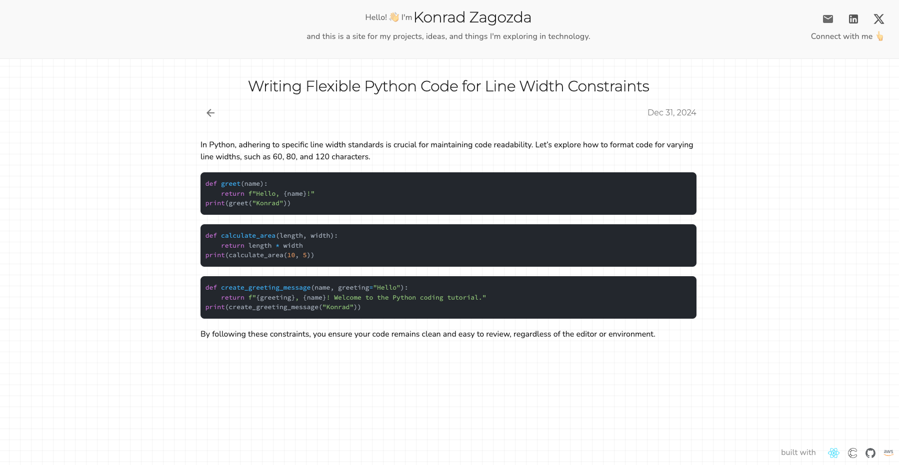

# Blog

This repository powers my website at [zagozdakonrad.com](https://zagozdakonrad.com) There is also an additional domain [konradzagozda.com](https://konradzagozda.com) that will redirect to the main domain.

## Architecture



The website architecture consists of:

- **Frontend**: React-based static website
- **CMS**: Contentful headless CMS for content management
- **Hosting**: AWS S3 static website hosting
- **CDN**: Amazon CloudFront with ACM SSL certificate
- **Infrastructure**: Managed via Terraform
- **CI/CD**: Automated deployments using GitHub Actions

## Cost Analysis

The infrastructure costs are kept minimal:

### Static Storage & Hosting

- **ACM Certificate**: Free
- **S3 Buckets**:
  - Main website bucket: ~$0.00046/month (20MB storage)
  - Redirect bucket: Free

### Domain & DNS (Route53)

- **Domain Registration**: $28 / year (for 2 domains)
- **Hosted Zones**: $1 / month (for 2 zones)

### Variable Costs

- CloudFront CDN traffic (pay per use)
- DNS query costs (pay per use)

> **Note**: The total fixed costs are $3.33046 / month plus minimal variable costs for actual traffic.

## Responsive Views

### Mobile





### Tablet





### Desktop





## CI/CD & Deployment

The site uses GitHub Actions for continuous integration and deployment with two environments:

### Staging

- Automatic deployment on push to main
- Uses default CloudFront domain

### Production

- Requires manual approval via GitHub issue comment
- Uses custom domains (zagozdakonrad.com, konradzagozda.com)
- Issue auto-closes after 72h if not approved

Both environments follow the same deployment steps:

- Provisions infrastructure using Terraform
- Builds the React application
- Deploys built assets to S3
- Creates CloudFront cache invalidation

## Local Development

### Requirements

- Node.js
- Yarn
- Contentful API keys (for CMS integration)

### Setup

1. Install dependencies:

```bash
cd frontend
yarn install
```

2. Start development server:

```bash
yarn dev
```